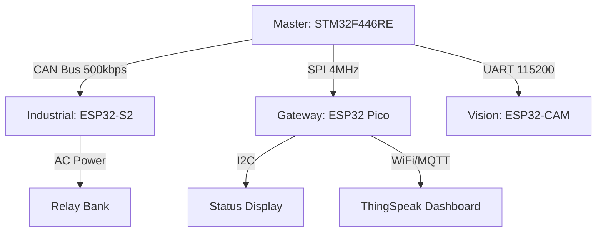

# The Citadel: Distributed Industrial Home Automation System


**A heterogeneous, safety-critical distributed control system using a star-topology network.**

This project goes beyond simple IoT by implementing an industrial-grade architecture where a **Real-Time Control Unit (STM32)** orchestrates multiple **Networked Nodes (ESP32)** via wired differential buses. It demonstrates how to decouple safety logic from cloud connectivity, ensuring that a WiFi failure never compromises physical automation.

## 🎯 Core Focus & Architecture

This repository is structured as a **Monorepo**, integrating four distinct microcontroller boards into a unified control plane.

| Platform Track | Core Architecture | Key Focus Areas |
| :--- | :--- | :--- |
| **STM32 F446RE** | **Master Node** (ARM Cortex-M4) | **FreeRTOS** Scheduler, Sensor Fusion, Safety State Machine, **CAN Bus Master**. |
| **ESP32-S2** | **Industrial Node** (Xtensa LX7) | High-Voltage Relay Control, Environmental Sensing, **CAN Bus Slave**, Failsafe Logic. |
| **ESP32 Pico** | **Gateway Node** (Xtensa LX6) | **HMI Display** (SPI), BLE Mobile Link, Cloud Telemetry (MQTT/AWS IoT). |
| **ESP32-CAM** | **Vision Node** (Xtensa LX6) | Edge AI (Face Detection), Asynchronous Event Generation via UART. |

---

## 🏗️ System Topology

The system uses a **Star Network** to optimize for latency and reliability:



## 🛠 Development Environment

| Platform | IDE/SDK | OS |
| :--- | :--- | :--- |
| **STM32** | STM32CubeIDE 1.18.0 | Ubuntu 24.04 |
| **ESP32** | ESP-IDF v5.5 | Ubuntu 24.04 |

---

## 🧭 Repository Overview

```

Home_Automation/
└── .vscode/                   # Editor configuration
├── docs/                      # Engineering Specifications
│   ├── FRS.md                 # Functional Requirements
│   └── High-Level-Design.md   # High-Level-Design docs
│   └── Low-Level-Design.md    # Low-Level-Design docs
│
├── firmware/                  # Source Code Monorepo
│   ├── common/                # Shared Headers (CAN IDs, Structs)
│   ├── stm32-master/          # STM32CubeIDE Project
│   ├── esp32-s2-industrial/   # ESP-IDF Project (Relays/CAN)
│   └── esp32-pico-gateway/    # ESP-IDF Project (Display/MQTT)
│
├── .gitignore                 # gitignore
├── LICENSE
└── README.md                  # You are here

```

## 🤝 Connect With Me

- **LinkedIn:** [linkedin.com/in/rahul-bari-embeddeddeveloper](https://linkedin.com/in/rahul-bari-embeddeddeveloper)
- **GitHub:** [@rahulbari717](https://github.com/rahulbari717)
- **Email:** rahulbari717@gmail.com

---

## 📄 License

This project is licensed under the MIT License - see the [LICENSE](LICENSE) file for details.

---

## ⭐ Support

If you find this repository helpful:
- ⭐ Star this repo
- 🔀 Fork and contribute
- 📢 Share with fellow embedded enthusiasts
- 💬 Open issues for discussions

---

**Happy Embedded Programming! 🚀**

*Last Updated: Jan 2026*


