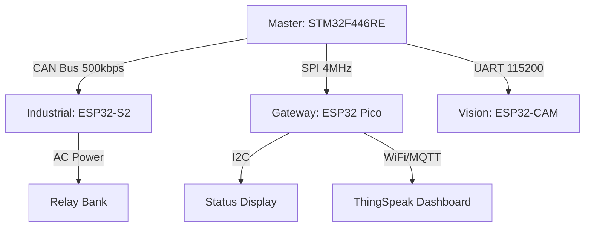

# The Citadel: Distributed Industrial Home Automation System


**A heterogeneous, safety-critical distributed control system using a star-topology network.**

This project goes beyond simple IoT by implementing an industrial-grade architecture where a **Real-Time Control Unit (STM32)** orchestrates multiple **Networked Nodes (ESP32)** via wired differential buses. It demonstrates how to decouple safety logic from cloud connectivity, ensuring that a WiFi failure never compromises physical automation.

## 🎯 Core Focus & Architecture

This repository is structured as a **Monorepo**, integrating four distinct microcontroller boards into a unified control plane.

| Platform Track | Core Architecture | Key Focus Areas |
| :--- | :--- | :--- |
| **STM32 F446RE** | **Master Node** (ARM Cortex-M4) | **FreeRTOS** Scheduler, Sensor Fusion, Safety State Machine, **CAN Bus Master**. |
| **ESP32-S2** | **Industrial Node** (Xtensa LX7) | High-Voltage Relay Control, Environmental Sensing, **CAN Bus Slave**, Failsafe Logic. |
| **ESP32 Pico** | **Gateway Node** (Xtensa LX6) | **HMI Display** (SPI), BLE Mobile Link, Cloud Telemetry (MQTT/AWS IoT). |
| **ESP32-CAM** | **Vision Node** (Xtensa LX6) | Edge AI (Face Detection), Asynchronous Event Generation via UART. |

---

## 🏗️ System Topology

The system uses a **Star Network** to optimize for latency and reliability:



## 🛠 Development Environment

| Platform | IDE/SDK | OS |
| :--- | :--- | :--- |
| **STM32** | STM32CubeIDE 1.18.0 | Ubuntu 24.04 |
| **ESP32** | ESP-IDF v5.5 | Ubuntu 24.04 |

---

## 🧭 Repository Overview

```

Home_Automation/
└── .vscode/                   # Editor configuration
├── docs/                      # Engineering Specifications
│   ├── FRS.md                 # Functional Requirements
│   └── High-Level-Design.md   # High-Level-Design docs
│   └── Low-Level-Design.md    # Low-Level-Design docs
│
├── firmware/                  # Source Code Monorepo
│   ├── common/                # Shared Headers (CAN IDs, Structs)
│   ├── stm32-master/          # STM32CubeIDE Project
│   ├── esp32-s2-industrial/   # ESP-IDF Project (Relays/CAN)
│   └── esp32-pico-gateway/    # ESP-IDF Project (Display/MQTT)
│
├── .gitignore                 # gitignore
├── LICENSE
└── README.md                  # You are here

```

## 🤝 Connect With Me

- **LinkedIn:** [linkedin.com/in/rahul-bari-embeddeddeveloper](https://linkedin.com/in/rahul-bari-embeddeddeveloper)
- **GitHub:** [@rahulbari717](https://github.com/rahulbari717)
- **Email:** rahulbari717@gmail.com

---

## 📄 License

This project is licensed under the MIT License - see the [LICENSE](LICENSE) file for details.

---

## ⭐ Support

If you find this repository helpful:
- ⭐ Star this repo
- 🔀 Fork and contribute
- 📢 Share with fellow embedded enthusiasts
- 💬 Open issues for discussions

---

**Happy Embedded Programming! 🚀**

*Last Updated: Jan 2026*


# Secure Smart Home Hub - STM32F446RE

## 📋 Project Overview

A sophisticated 3-level hierarchical menu system for a smart home control hub using STM32F446RE microcontroller with:
- 4x4 Matrix Keypad for input
- 16x2 LCD display (no I2C, 4-bit mode)
- Multi-user authentication with PIN-based security
- Room-based access control
- Deep sleep power saving mode

## 🔧 Hardware Requirements

### Components
- **STM32F446RE Nucleo Board**
- **4x4 Matrix Keypad**
- **16x2 LCD Display** (HD44780 compatible, 4-bit mode)
- **2x LEDs** (Green for success, Red for errors)
- **Buzzer** (Active or Passive)
- **Push Button** (for wakeup)
- **Resistors** and connecting wires

### Pin Connections

#### Keypad (4x4 Matrix)
| Keypad Pin | STM32 Pin | Description |
|------------|-----------|-------------|
| R0         | PB0       | Row 0 (Output) |
| R1         | PB1       | Row 1 (Output) |
| R2         | PB2       | Row 2 (Output) |
| R3         | PB3       | Row 3 (Output) |
| C0         | PB4       | Column 0 (Input with Pull-up) |
| C1         | PB5       | Column 1 (Input with Pull-up) |
| C2         | PB6       | Column 2 (Input with Pull-up) |
| C3         | PB7       | Column 3 (Input with Pull-up) |

#### 📟 LCD 16×2 (JHD162A) → STM32 Connection Table(4-bit Mode)
| LCD Pin | STM32 Pin | Description |
|---------|-----------|-------------|
| RS      | PC0       | Register Select |
| EN      | PC1       | Enable |
| D4      | PC2       | Data bit 4 |
| D5      | PC3       | Data bit 5 |
| D6      | PC4       | Data bit 6 |
| D7      | PC5       | Data bit 7 |
| VSS     | GND       | Ground |
| VDD     | +5V       | Power |
| V0      | Pot       | Contrast (10k potentiometer) |
| RW      | GND       | Read/Write (tied to GND for Write mode) |
| A (LED+)| +5V       | Backlight positive (through 220Ω resistor) |
| K (LED-)| GND       | Backlight negative |
 |
#### 📟 LCD 16×2 (JHD162A) → STM32 Complete Pin-by-Pin Wiring (4-bit Mode)

#### 🔗 Complete Pin-by-Pin Wiring (1 → 16)

| LCD Pin No. | LCD Pin Name | STM32 / Connection | Notes |
|:-----------:|:------------:|:-------------------|:------|
| 1  | VSS      | GND                | Ground |
| 2  | VDD      | +5V                | LCD Power |
| 3  | V0       | GND                | Maximum contrast (no potentiometer) |
| 4  | RS       | PC0                | Register Select |
| 5  | RW       | GND                | Write-only mode |
| 6  | EN       | PC1                | Enable pulse |
| 7  | D0       | Not connected      | Unused (4-bit mode) |
| 8  | D1       | Not connected      | Unused |
| 9  | D2       | Not connected      | Unused |
| 10 | D3       | Not connected      | Unused |
| 11 | D4       | PC2                | Data bit 4 |
| 12 | D5       | PC3                | Data bit 5 |
| 13 | D6       | PC4                | Data bit 6 |
| 14 | D7       | PC5                | Data bit 7 |
| 15 | A (LED+) | +5V via 220Ω       | Backlight Anode |
| 16 | K (LED-) | GND                | Backlight Cathode |


#### LEDs and Buzzer
| Component | STM32 Pin | Description |
|-----------|-----------|-------------|
| Green LED | PA5       | Success indicator (through 330Ω resistor) |
| Red LED   | PA6       | Error indicator (through 330Ω resistor) |
| Buzzer    | PA7       | Audio feedback |

#### Wakeup Button
| Component | STM32 Pin | Description |
|-----------|-----------|-------------|
| Button    | PC13      | Wakeup from sleep (with external pull-up) |

#### Room Control Outputs (Port D)
| Device           | Pin  | Description |
|------------------|------|-------------|
| Hall Light       | PD0  | Relay control |
| Hall Fan         | PD1  | Relay control |
| Hall TV          | PD2  | Relay control |
| Kitchen Light    | PD3  | Relay control |
| Kitchen Exhaust  | PD4  | Relay control |
| Kitchen Coffee   | PD5  | Relay control |
| MBed Lamp        | PD6  | PWM capable (dimmer) |
| MBed AC          | PD7  | Relay control |
| MBed Fan         | PD8  | Speed control |
| GBed Lamp        | PD9  | PWM capable (dimmer) |
| GBed AC          | PD10 | Relay control |
| GBed Fan         | PD11 | Speed control |
| Garden Sprinkler | PD12 | Relay control |
| Garden Light     | PD13 | Relay control |
| Garden Fountain  | PD14 | Relay control |

## 📁 Project Structure

```
SmartHomeHub/
├── Inc/
│   ├── stm32f446xx.h           (Your existing MCU header)
│   ├── stm32f446xx_gpio_driver.h
│   ├── config.h                (System configuration)
│   ├── lcd.h                   (LCD driver)
│   ├── keypad.h                (Keypad driver)
│   ├── menu.h                  (Menu system)
│   ├── user_auth.h             (Authentication)
│   └── room_control.h          (Device control)
├── Src/
│   ├── main.c                  (Main application)
│   ├── stm32f446xx_gpio_driver.c
│   ├── lcd.c
│   ├── keypad.c
│   ├── menu.c (Part 1 & 2)
│   ├── user_auth.c
│   └── room_control.c
└── Startup/
    └── startup_stm32f446xx.s
```

## 🚀 Getting Started

### 1. Build Configuration
- **IDE**: STM32CubeIDE or Keil MDK
- **Toolchain**: ARM GCC
- **Optimization**: -O0 (for debugging) or -O2 (for production)

### 2. Default Credentials
```
Username: Admin
PIN: 1234
```

### 3. Keypad Layout
```
┌───┬───┬───┬───┐
│ 1 │ 2 │ 3 │ A │
├───┼───┼───┼───┤
│ 4 │ 5 │ 6 │ B │
├───┼───┼───┼───┤
│ 7 │ 8 │ 9 │ C │
├───┼───┼───┼───┤
│ * │ 0 │ # │ D │
└───┴───┴───┴───┘
```

**Navigation Keys:**
- `2` = UP
- `8` = DOWN
- `5` = ENTER
- `*` = BACK
- `#` = LOGOUT

## 🔐 System States

### 1. Deep Sleep Mode
- All peripherals OFF
- Red LED blinks every 5 seconds
- Press wakeup button (PC13) to wake

### 2. Authentication Mode
- Enter 4-digit PIN
- 3 attempts allowed
- Green LED + beep on success
- Red LED + beep on failure
- Lockout after 3 failed attempts

### 3. Menu Navigation Mode
- Browse and control rooms
- Check permissions
- Manage users (admin only)

### 4. Lockout Mode
- 20-second lockout
- Alternating buzzer and red LED
- Automatic return to deep sleep

## 📱 Menu Hierarchy

```
MAIN MENU
├── 1. Help & Info
│   ├── About Device
│   ├── Uptime Stats
│   └── Error Logs
│
├── 2. Room Control
│   ├── Hall
│   │   ├── Main Light (ON/OFF)
│   │   ├── Ceiling Fan (ON/OFF, Speed 1-4)
│   │   └── TV System (ON/OFF)
│   │
│   ├── Kitchen
│   │   ├── Ceiling Light (ON/OFF)
│   │   ├── Exhaust Fan (ON/OFF)
│   │   └── Coffee Maker (ON/OFF)
│   │
│   ├── Master Bedroom
│   │   ├── Night Lamp (Dimmer 10-100%)
│   │   ├── AC Control (16-30°C)
│   │   ├── Blinds (Open/Close)
│   │   └── Ceiling Fan (Speed 0-4)
│   │
│   ├── Guest Bedroom
│   │   ├── Night Lamp (Dimmer 10-100%)
│   │   ├── AC Control (16-30°C)
│   │   ├── Blinds (Open/Close)
│   │   └── Ceiling Fan (Speed 0-4)
│   │
│   └── Garden
│       ├── Sprinkler (ON/OFF)
│       ├── Porch Light (ON/OFF)
│       └── Fountain (ON/OFF)
│
└── 3. User Admin (Admin Only)
    ├── Register User
    ├── Delete User
    ├── List Users
    ├── Change Admin PIN
    └── Factory Reset
```

## 👥 User Management

### User Types
1. **Super User (Admin)**
   - Full access to all rooms
   - Can create/delete users
   - Can assign room permissions
   - Can perform factory reset

2. **Normal User**
   - Access only to assigned rooms
   - Cannot manage other users

### Room Permissions (Bit Flags)
```c
ROOM_HALL         = 0x01
ROOM_KITCHEN      = 0x02
ROOM_MASTER_BED   = 0x04
ROOM_GUEST_BED    = 0x08
ROOM_STORE        = 0x10
ROOM_GARDEN       = 0x20
ROOM_STUDY        = 0x40
ROOM_PUJA         = 0x80
ROOM_ALL          = 0xFF
```

## 🎮 Usage Examples

### Turning On Hall Light
1. Wake system (press button)
2. Enter PIN: `1234#`
3. Navigate: `2` (down) to "Room Control"
4. Press `5` (enter)
5. Select "Hall" (already selected)
6. Press `5` (enter)
7. Select "Main Light"
8. Press `5` (toggle ON)

### Setting AC Temperature
1. Navigate to Master Bedroom → AC Control
2. Press `5` (enter)
3. Use `2` to increase temperature
4. Use `8` to decrease temperature
5. Press `5` to toggle AC ON/OFF
6. Press `#` to save and exit

### Registering New User (Admin)
1. Navigate to User Admin → Register User
2. Enter username via keypad
3. Enter 4-digit PIN
4. Select admin status (5=Yes, *=No)
5. Assign room permissions

## 🐛 Troubleshooting

### LCD Shows Nothing
- Check contrast potentiometer
- Verify power connections (VSS, VDD)
- Verify pin connections (RS, EN, D4-D7)

### Keypad Not Responding
- Check row/column connections
- Verify pull-up resistors on columns
- Test individual keys with multimeter

### Authentication Always Fails
- Default PIN is `1234`
- Try factory reset (menu option)
- Check keypad number mapping

### System Won't Wake Up
- Check PC13 button connection
- Verify external pull-up resistor
- Check interrupt configuration

## 🔧 Customization

### Adding New Rooms
1. Define new pin in `config.h`
2. Add device to `DeviceID_t` enum in `room_control.h`
3. Add pin mapping in `room_control.c`
4. Create menu node in `menu.c`
5. Link to room control menu

### Changing PIN Length
Edit `config.h`:
```c
#define PIN_LENGTH  6  // Change from 4 to 6 digits
```

### Adjusting Timeout
Edit `config.h`:
```c
#define LOCKOUT_TIME_SEC  30  // Change from 20 to 30 seconds
```

## 📊 Memory Usage (Approximate)
- **Flash**: ~25 KB
- **RAM**: ~2 KB
- **Stack**: 1 KB (configurable)

## 🔒 Security Features
- PIN-based authentication
- 3-attempt lockout mechanism
- Role-based access control
- Room-level permissions
- Secure logout with device shutdown

## 📝 License
This project is provided as-is for educational purposes.

## 👨‍💻 Author
**Rahul B.**
- Date: January 12, 2026
- Version: 1.0.0

## 🙏 Acknowledgments
- STM32 HAL Library
- HD44780 LCD datasheet
- Matrix keypad scanning algorithms


Advanced Features:

✅ 3-level deep menu hierarchy using tree structure
✅ PIN-based authentication (4 digits)
✅ 3-strike lockout system
✅ Room-based permission control
✅ Super user vs. normal user roles
✅ Deep sleep mode with wakeup interrupt
✅ Visual (LED) and audio (buzzer) feedback


Here's a quick one-line explanation for each major peripheral:

**Core & Memory:**
- **Flash** - Stores program code and constant data permanently
- **SRAM** - Fast temporary memory for variables and stack during program execution
- **CRC** - Calculates checksums to verify data integrity
- **FMC** - Interfaces with external memory chips (SRAM, Flash, SDRAM)
- **QUADSPI** - High-speed interface for external Flash memory chips

**Timing & Control:**
- **RCC** - Manages all system clocks and peripheral resets
- **PWR** - Controls power modes and voltage regulation
- **RTC** - Keeps track of time/date with calendar and alarms
- **IWDG/WWDG** - Watchdog timers that reset the system if software hangs
- **TIM1-14** - Generate PWM signals, measure timing, count events

**Communication:**
- **USART/UART** - Serial communication with other devices
- **SPI** - High-speed synchronous data exchange
- **I2C/FMPI2C** - Two-wire bus for connecting sensors and peripherals
- **CAN** - Robust communication for automotive/industrial applications
- **SDIO** - Interface for SD cards and SDIO devices
- **USB OTG** - USB host/device connectivity
- **SAI** - High-quality digital audio interface
- **SPDIFRX** - Receives digital audio from optical/coaxial sources
- **HDMI-CEC** - Control commands over HDMI connections

**Analog:**
- **ADC** - Converts analog voltages to digital values
- **DAC** - Converts digital values to analog voltages

**Other:**
- **GPIO** - General purpose input/output pins for interfacing
- **DMA** - Moves data between memory and peripherals without CPU
- **EXTI** - Detects external pin changes and generates interrupts
- **DCMI** - Captures video/images from camera sensors
- **DBG** - Debugging and trace support for development


Here's a simple 2-line explanation for each peripheral:
Embedded Flash Memory Interface

Stores your program code permanently (even when power is off)
Allows reading/writing/erasing program memory with access control and protection

CRC Calculation Unit

Quickly calculates checksums to detect data corruption
Useful for verifying data integrity in communication or storage

Power Controller (PWR)

Manages different power modes (sleep, stop, standby) to save battery
Controls voltage regulators and monitors power supply

Reset and Clock Control (RCC)

Distributes clock signals to all peripherals (like a master clock)
Controls which peripherals are turned on/off and handles system resets

System Configuration Controller (SYSCFG)

Remaps memory locations and configures special pin functions
Routes external interrupts and manages I/O compensation

Direct Memory Access (DMA)

Automatically moves data between memory and peripherals without CPU help
Frees up the processor to do other tasks while data transfers happen

Interrupts and Events

Allows external signals or internal events to interrupt the CPU
Makes the system responsive to urgent events (button press, timer overflow, etc.)

Flexible Memory Controller (FMC)

Connects to external memory chips (SRAM, Flash, SDRAM, etc.)
Expands available memory beyond the internal limits

Quad-SPI Interface (QUADSPI)

Fast interface for external SPI Flash memory (uses 4 data lines)
Can execute code directly from external Flash (memory-mapped mode)

Analog-to-Digital Converter (ADC)

Converts real-world analog signals (temperature, voltage) into digital numbers
Lets the microcontroller measure and process analog sensor data

Digital-to-Analog Converter (DAC)

Converts digital numbers into analog voltage output
Generates analog signals (audio, control voltages, waveforms)

Digital Camera Interface (DCMI)

Captures image/video data from camera sensors
Handles high-speed parallel data transfer with DMA support

Advanced-Control Timers (TIM1 & TIM8)

Generate precise PWM signals for motor control (with dead-time insertion)
Advanced features: complementary outputs, brake input, encoder interface

General-Purpose Timers (TIM2-TIM5)

Generate PWM, measure time intervals, count pulses
Flexible 32-bit timers with input capture and output compare

General-Purpose Timers (TIM9-TIM14)

Simpler 16-bit timers for basic timing and PWM tasks
Lower resource usage for less demanding applications

Basic Timers (TIM6 & TIM7)

Simple up-counters mainly used to trigger DAC conversions
Can also generate time-based interrupts

Independent Watchdog (IWDG)

Resets the system if software crashes or hangs
Runs on independent clock, must be periodically refreshed ("kicked")

Window Watchdog (WWDG)

Similar to IWDG but must be refreshed within a specific time window
Detects both early and late software malfunctions

Real-Time Clock (RTC)

Keeps accurate time and date (calendar with alarms)
Runs on low-power backup battery, survives system resets

Fast-Mode Plus I2C (FMPI2C)

Enhanced I2C interface supporting 1 MHz speed
Modern I2C with improved features (SMBus support, wakeup capability)

Serial Peripheral Interface / I2S (SPI/I2S)

SPI: High-speed synchronous communication (sensors, displays, SD cards)
I2S: Digital audio interface for audio codecs and devices

SPDIF Receiver (SPDIFRX)

Receives digital audio from optical or coaxial cables
Decodes professional audio streams (like from CD players, receivers)

Serial Audio Interface (SAI)

High-quality multi-channel digital audio (I2S, AC'97, SPDIF output)
Professional audio applications with flexible configurations

Secure Digital I/O (SDIO)

Interface for SD/MMC memory cards
Also supports SDIO devices (WiFi modules, etc.)

Controller Area Network (bxCAN)

Robust communication bus for automotive/industrial environments
Handles noisy environments with error detection and message filtering

USB On-The-Go (OTG_FS/HS)

Full USB host or device functionality (can be both)
Supports full-speed (12 Mbps) and high-speed (480 Mbps) modes

HDMI-CEC Controller

Sends control commands over HDMI cable (one remote for all devices)
Allows device communication in home entertainment systems

Debug Support (DBG)

Programming and debugging interface (JTAG/SWD)
Allows breakpoints, memory inspection, and code tracing during development

Device Electronic Signature

Unique ID for each chip and device information (memory size, package type)
Used for product identification and security features


1. Core & Memory
These drivers handle the internal storage and memory interfaces.

Flash: stm32f4xx_flash.c / .h

Functions: Unlock Flash, Erase Sectors, Program Addresses.

SRAM: (Usually handled inside FMC)

Note: Internal SRAM is ready at startup; you rarely write a driver for it.

CRC: stm32f4xx_crc.c / .h

Functions: CRC_ResetDR(), CRC_CalcCRC().

FMC: stm32f4xx_fmc.c / .h

Functions: Configures timing for external RAM/NorFlash.

QUADSPI: stm32f4xx_qspi.c / .h

Functions: Init QSPI, Command transmission (Write/Read).

2. Timing & Control
This is the heartbeat of your system.

RCC: stm32f4xx_rcc.c / .h (Most Important)

Functions: RCC_OscConfig, RCC_PeriphClockCmd (Enable clocks for GPIO, UART, etc.).

PWR: stm32f4xx_pwr.c / .h

Functions: PWR_EnterSleepMode, PWR_RegulatorConfig.

RTC: stm32f4xx_rtc.c / .h

Functions: RTC_SetTime, RTC_SetDate, RTC_SetAlarm.

IWDG/WWDG: stm32f4xx_iwdg.c, stm32f4xx_wwdg.c

Functions: IWDG_ReloadCounter, WWDG_SetWindowValue.

TIM: stm32f4xx_tim.c / .h

Functions: TIM_TimeBaseInit, TIM_OC1Init (PWM), TIM_ICInit (Input Capture).

3. Communication
These files implement the protocols to talk to the outside world.

USART/UART: stm32f4xx_usart.c / .h

Functions: USART_SendData, USART_ReceiveData, USART_Init.

SPI: stm32f4xx_spi.c / .h

Functions: SPI_Init, SPI_I2S_SendData, SPI_I2S_ReceiveData.

I2C: stm32f4xx_i2c.c / .h

Functions: I2C_GenerateSTART, I2C_Send7bitAddress.

CAN: stm32f4xx_can.c / .h

Functions: CAN_Init, CAN_Transmit.

SDIO: stm32f4xx_sdio.c / .h

Functions: SDIO_Init, SDIO_SendCommand (Often used with a middleware layer like FATFS).

USB OTG: stm32f4xx_usbd.c (Device) / stm32f4xx_usbh.c (Host)

Note: USB is complex. The LL driver handles the hardware endpoints (PCD/HCD), but you almost always need a Middleware stack on top of this.

SAI: stm32f4xx_sai.c / .h

SPDIFRX: stm32f4xx_spdifrx.c / .h

HDMI-CEC: stm32f4xx_cec.c / .h

4. Analog
Interfacing with the real world (sensors and audio).

ADC: stm32f4xx_adc.c / .h

Functions: ADC_Init, ADC_RegularChannelConfig, ADC_SoftwareStartConv.

DAC: stm32f4xx_dac.c / .h

Functions: DAC_Init, DAC_SetChannel1Data.

5. Other
The utilities that glue everything together.

GPIO: stm32f4xx_gpio.c / .h

Functions: GPIO_Init, GPIO_WriteBit, GPIO_ReadInputDataBit.

DMA: stm32f4xx_dma.c / .h

Functions: DMA_Init, DMA_Cmd (Enable/Disable stream).

EXTI: stm32f4xx_exti.c / .h

Functions: EXTI_Init (Map pin to interrupt line).

DCMI: stm32f4xx_dcmi.c / .h

Functions: DCMI_Init, DCMI_CaptureCmd.

DBG: stm32f4xx_dbgmcu.c / .h

Functions: DBGMCU_Config (e.g., Keep timers running while CPU is halted in debug mode).

Summary of What Goes Inside
Since you are writing these (or reviewing them):

The Header (.h):

Structure Definitions: typedef struct { uint32_t Pin; uint32_t Mode; ... } GPIO_InitTypeDef;

Macros: #define GPIO_PIN_5 (1U << 5)

Prototypes: void GPIO_Init(GPIO_TypeDef* GPIOx, GPIO_InitTypeDef* GPIO_InitStruct);

The Source (.c):

Register Math: The actual code that touches the memory.

GPIOx->MODER |= (GPIO_InitStruct->Mode << (pinpos * 2));

Project Tip: You don't need all of these files for every project. If your project is just "Blinky," you only need RCC (clocks) and GPIO (pins). You can add the others (SPI, UART) only when you need them.


To learn device driver development from scratch, you cannot just jump into SPI or I2C. You must follow a specific hierarchy because complex drivers rely on simpler ones.Here is the prioritized list of peripherals you need to master, ranked from "Absolute Foundation" (High Priority) to "Specialized/Advanced" (Low Priority).1. The Foundation (You cannot skip these)Before you write a driver for a sensor, you must master these. If these are wrong, nothing else works.PriorityPeripheralWhy it is #11RCC (Reset & Clock Control)The Heart. In STM32/ARM, every peripheral is "OFF" by default to save power. You must write an RCC driver to enable clocks before you can use GPIO, UART, or SPI.2GPIO (General Purpose I/O)The Hands. Every other protocol (SPI, I2C, UART) eventually uses pins. You need to know how to configure pins as Inputs, Outputs, or Alternate Functions.3NVIC / EXTI (Interrupts)The Nerves. Real-world drivers don't just "wait" (polling); they use interrupts. You must learn how to enable IRQs (e.g., "Tell CPU when a byte arrives").4SysTick (System Timer)The Pulse. Used for simple delays (delay_ms) and is the heartbeat for RTOS later.2. The Core Connectivity (The "Big 4" you asked about)Once the foundation is ready, learn these in this specific order.1. UART / USART (Universal Asynchronous Receiver-Transmitter)Why First? It is your Debugging Tool.Goal: Write a driver that allows you to use printf() to send text to your computer screen. Without this, you are coding blind.Key Concept: Baud rate calculation, Transmit (TX) vs Receive (RX).2. SPI (Serial Peripheral Interface)Why Second? It is simpler than I2C. It has no complex addresses or acknowledgments.Use Cases: TFT Displays, SD Cards, Flash Memory chips.Key Concept: Master/Slave, Clock Polarity (CPOL) & Phase (CPHA).3. I2C (Inter-Integrated Circuit)Why Third? It is harder to debug. It requires pull-up resistors and has complex "Start," "Stop," and "Ack" conditions.Use Cases: Most sensors (Temperature, Accelerometer, Gyro).Key Concept: Device Addresses (7-bit), Open-Drain configuration.3. The "Force Multipliers" (High Priority Extras)These are not communication protocols, but they make your drivers professional and high-performance.1. TIM (General Purpose Timers)Priority: HighWhy: You need this for PWM (dimming LEDs, controlling motor speed) and for precise timing measurements (measuring how long a signal is high).Key Concept: Prescalers, Auto-Reload Register (ARR), Capture/Compare.2. ADC (Analog-to-Digital Converter)Priority: Medium-HighWhy: The real world is analog (Battery voltage, Temperature, Microphone audio).Key Concept: Sampling time, Resolution (12-bit vs 10-bit), Continuous vs Single mode.3. DMA (Direct Memory Access)Priority: Medium (But Critical for "Pro" level)Why: It allows you to transfer data (e.g., from UART to RAM) without using the CPU.Key Concept: Circular buffers, memory-to-peripheral transfer. Note: Learn this only after you master the standard polling/interrupt drivers.4. Specialized / Low Priority (Learn Later)Don't worry about these until you have a specific project needing them.WWDG / IWDG (Watchdogs): Essential for product reliability (restarts system if it hangs), but annoying during development.RTC (Real Time Clock): Just for keeping dates/time.Flash / EEPROM: Writing data to the chip's internal permanent memory.CAN Bus: Critical for Automotive (cars), but complex.USB: Very complex. Usually, people use Middleware (TinyUSB or ST's USB Stack) rather than writing a driver from scratch.Recommended Learning Path (Step-by-Step)RCC + GPIO: Blink an LED using registers.SysTick: Create a delay(1000) function without a for loop.UART: Send "Hello World" to your PC.Interrupts: Toggle LED when a Button is pressed (using EXTI).SPI: Communicate with a simple shift register or display.I2C: Read temperature from a sensor (like MPU6050 or BMP180).ADC + DMA: Read a potentiometer value continuously without blocking the CPU.


Priority Ranking for Professional Projects:
Tier 1 (Always Include):

DMA, NVIC/Interrupt, Timer, Systick, Flash, PWR

Tier 2 (Very Common):

ADC, IWDG, EXTI

Tier 3 (Application Specific):

CAN, USB, SDIO, RTC, DAC, Advanced Timers

Most professional projects use 8-12 drivers minimum from this list!

```

## **4. Connection Diagram**
```
STM32F446RE Connections:
========================

KEYPAD (4x4 Matrix):
--------------------
R0 → PB0 (Row 0 - Output)
R1 → PB1 (Row 1 - Output)
R2 → PB2 (Row 2 - Output)
R3 → PB3 (Row 3 - Output)

C0 → PB4 (Column 0 - Input with Pull-up)
C1 → PB5 (Column 1 - Input with Pull-up)
C2 → PB6 (Column 2 - Input with Pull-up)
C3 → PB7 (Column 3 - Input with Pull-up)

LCD 16*2 


UART2 (for minicom):
--------------------
PA2 → TX (Connect to USB-Serial RX)
PA3 → RX (Connect to USB-Serial TX)
GND → GND