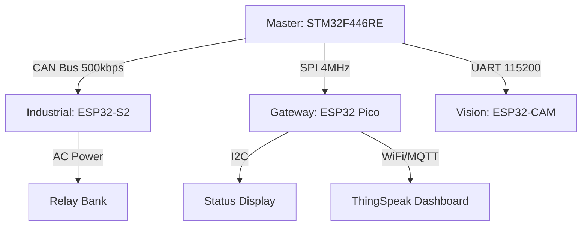

# The Citadel: Distributed Industrial Home Automation System


**A heterogeneous, safety-critical distributed control system using a star-topology network.**

This project goes beyond simple IoT by implementing an industrial-grade architecture where a **Real-Time Control Unit (STM32)** orchestrates multiple **Networked Nodes (ESP32)** via wired differential buses. It demonstrates how to decouple safety logic from cloud connectivity, ensuring that a WiFi failure never compromises physical automation.

## 🎯 Core Focus & Architecture

This repository is structured as a **Monorepo**, integrating four distinct microcontroller boards into a unified control plane.

| Platform Track | Core Architecture | Key Focus Areas |
| :--- | :--- | :--- |
| **STM32 F446RE** | **Master Node** (ARM Cortex-M4) | **FreeRTOS** Scheduler, Sensor Fusion, Safety State Machine, **CAN Bus Master**. |
| **ESP32-S2** | **Industrial Node** (Xtensa LX7) | High-Voltage Relay Control, Environmental Sensing, **CAN Bus Slave**, Failsafe Logic. |
| **ESP32 Pico** | **Gateway Node** (Xtensa LX6) | **HMI Display** (SPI), BLE Mobile Link, Cloud Telemetry (MQTT/AWS IoT). |
| **ESP32-CAM** | **Vision Node** (Xtensa LX6) | Edge AI (Face Detection), Asynchronous Event Generation via UART. |

---

## 🏗️ System Topology

The system uses a **Star Network** to optimize for latency and reliability:



## 🛠 Development Environment

| Platform | IDE/SDK | OS |
| :--- | :--- | :--- |
| **STM32** | STM32CubeIDE 1.18.0 | Ubuntu 24.04 |
| **ESP32** | ESP-IDF v5.5 | Ubuntu 24.04 |

---

## 🧭 Repository Overview

```

Home_Automation/
└── .vscode/                   # Editor configuration
├── docs/                      # Engineering Specifications
│   ├── FRS.md                 # Functional Requirements
│   └── High-Level-Design.md   # High-Level-Design docs
│   └── Low-Level-Design.md    # Low-Level-Design docs
│
├── firmware/                  # Source Code Monorepo
│   ├── common/                # Shared Headers (CAN IDs, Structs)
│   ├── stm32-master/          # STM32CubeIDE Project
│   ├── esp32-s2-industrial/   # ESP-IDF Project (Relays/CAN)
│   └── esp32-pico-gateway/    # ESP-IDF Project (Display/MQTT)
│
├── .gitignore                 # gitignore
├── LICENSE
└── README.md                  # You are here

```

## 🤝 Connect With Me

- **LinkedIn:** [linkedin.com/in/rahul-bari-embeddeddeveloper](https://linkedin.com/in/rahul-bari-embeddeddeveloper)
- **GitHub:** [@rahulbari717](https://github.com/rahulbari717)
- **Email:** rahulbari717@gmail.com

---

## 📄 License

This project is licensed under the MIT License - see the [LICENSE](LICENSE) file for details.

---

## ⭐ Support

If you find this repository helpful:
- ⭐ Star this repo
- 🔀 Fork and contribute
- 📢 Share with fellow embedded enthusiasts
- 💬 Open issues for discussions

---

**Happy Embedded Programming! 🚀**

*Last Updated: Jan 2026*


# Secure Smart Home Hub - STM32F446RE

## 📋 Project Overview

A sophisticated 3-level hierarchical menu system for a smart home control hub using STM32F446RE microcontroller with:
- 4x4 Matrix Keypad for input
- 16x2 LCD display (no I2C, 4-bit mode)
- Multi-user authentication with PIN-based security
- Room-based access control
- Deep sleep power saving mode

## 🔧 Hardware Requirements

### Components
- **STM32F446RE Nucleo Board**
- **4x4 Matrix Keypad**
- **16x2 LCD Display** (HD44780 compatible, 4-bit mode)
- **2x LEDs** (Green for success, Red for errors)
- **Buzzer** (Active or Passive)
- **Push Button** (for wakeup)
- **Resistors** and connecting wires

### Pin Connections

#### Keypad (4x4 Matrix)
| Keypad Pin | STM32 Pin | Description |
|------------|-----------|-------------|
| R0         | PB0       | Row 0 (Output) |
| R1         | PB1       | Row 1 (Output) |
| R2         | PB2       | Row 2 (Output) |
| R3         | PB3       | Row 3 (Output) |
| C0         | PB4       | Column 0 (Input with Pull-up) |
| C1         | PB5       | Column 1 (Input with Pull-up) |
| C2         | PB6       | Column 2 (Input with Pull-up) |
| C3         | PB7       | Column 3 (Input with Pull-up) |

#### 📟 LCD 16×2 (JHD162A) → STM32 Connection Table(4-bit Mode)
| LCD Pin | STM32 Pin | Description |
|---------|-----------|-------------|
| RS      | PC0       | Register Select |
| EN      | PC1       | Enable |
| D4      | PC2       | Data bit 4 |
| D5      | PC3       | Data bit 5 |
| D6      | PC4       | Data bit 6 |
| D7      | PC5       | Data bit 7 |
| VSS     | GND       | Ground |
| VDD     | +5V       | Power |
| V0      | Pot       | Contrast (10k potentiometer) |
| RW      | GND       | Read/Write (tied to GND for Write mode) |
| A (LED+)| +5V       | Backlight positive (through 220Ω resistor) |
| K (LED-)| GND       | Backlight negative |
 |
#### 📟 LCD 16×2 (JHD162A) → STM32 Complete Pin-by-Pin Wiring (4-bit Mode)

#### 🔗 Complete Pin-by-Pin Wiring (1 → 16)

| LCD Pin No. | LCD Pin Name | STM32 / Connection | Notes |
|:-----------:|:------------:|:-------------------|:------|
| 1  | VSS      | GND                | Ground |
| 2  | VDD      | +5V                | LCD Power |
| 3  | V0       | GND                | Maximum contrast (no potentiometer) |
| 4  | RS       | PC0                | Register Select |
| 5  | RW       | GND                | Write-only mode |
| 6  | EN       | PC1                | Enable pulse |
| 7  | D0       | Not connected      | Unused (4-bit mode) |
| 8  | D1       | Not connected      | Unused |
| 9  | D2       | Not connected      | Unused |
| 10 | D3       | Not connected      | Unused |
| 11 | D4       | PC2                | Data bit 4 |
| 12 | D5       | PC3                | Data bit 5 |
| 13 | D6       | PC4                | Data bit 6 |
| 14 | D7       | PC5                | Data bit 7 |
| 15 | A (LED+) | +5V via 220Ω       | Backlight Anode |
| 16 | K (LED-) | GND                | Backlight Cathode |


#### LEDs and Buzzer
| Component | STM32 Pin | Description |
|-----------|-----------|-------------|
| Green LED | PA5       | Success indicator (through 330Ω resistor) |
| Red LED   | PA6       | Error indicator (through 330Ω resistor) |
| Buzzer    | PA7       | Audio feedback |

#### Wakeup Button
| Component | STM32 Pin | Description |
|-----------|-----------|-------------|
| Button    | PC13      | Wakeup from sleep (with external pull-up) |

#### Room Control Outputs (Port D)
| Device           | Pin  | Description |
|------------------|------|-------------|
| Hall Light       | PD0  | Relay control |
| Hall Fan         | PD1  | Relay control |
| Hall TV          | PD2  | Relay control |
| Kitchen Light    | PD3  | Relay control |
| Kitchen Exhaust  | PD4  | Relay control |
| Kitchen Coffee   | PD5  | Relay control |
| MBed Lamp        | PD6  | PWM capable (dimmer) |
| MBed AC          | PD7  | Relay control |
| MBed Fan         | PD8  | Speed control |
| GBed Lamp        | PD9  | PWM capable (dimmer) |
| GBed AC          | PD10 | Relay control |
| GBed Fan         | PD11 | Speed control |
| Garden Sprinkler | PD12 | Relay control |
| Garden Light     | PD13 | Relay control |
| Garden Fountain  | PD14 | Relay control |

## 📁 Project Structure

```
SmartHomeHub/
├── Inc/
│   ├── stm32f446xx.h           (Your existing MCU header)
│   ├── stm32f446xx_gpio_driver.h
│   ├── config.h                (System configuration)
│   ├── lcd.h                   (LCD driver)
│   ├── keypad.h                (Keypad driver)
│   ├── menu.h                  (Menu system)
│   ├── user_auth.h             (Authentication)
│   └── room_control.h          (Device control)
├── Src/
│   ├── main.c                  (Main application)
│   ├── stm32f446xx_gpio_driver.c
│   ├── lcd.c
│   ├── keypad.c
│   ├── menu.c (Part 1 & 2)
│   ├── user_auth.c
│   └── room_control.c
└── Startup/
    └── startup_stm32f446xx.s
```

## 🚀 Getting Started

### 1. Build Configuration
- **IDE**: STM32CubeIDE or Keil MDK
- **Toolchain**: ARM GCC
- **Optimization**: -O0 (for debugging) or -O2 (for production)

### 2. Default Credentials
```
Username: Admin
PIN: 1234
```

### 3. Keypad Layout
```
┌───┬───┬───┬───┐
│ 1 │ 2 │ 3 │ A │
├───┼───┼───┼───┤
│ 4 │ 5 │ 6 │ B │
├───┼───┼───┼───┤
│ 7 │ 8 │ 9 │ C │
├───┼───┼───┼───┤
│ * │ 0 │ # │ D │
└───┴───┴───┴───┘
```

**Navigation Keys:**
- `2` = UP
- `8` = DOWN
- `5` = ENTER
- `*` = BACK
- `#` = LOGOUT

## 🔐 System States

### 1. Deep Sleep Mode
- All peripherals OFF
- Red LED blinks every 5 seconds
- Press wakeup button (PC13) to wake

### 2. Authentication Mode
- Enter 4-digit PIN
- 3 attempts allowed
- Green LED + beep on success
- Red LED + beep on failure
- Lockout after 3 failed attempts

### 3. Menu Navigation Mode
- Browse and control rooms
- Check permissions
- Manage users (admin only)

### 4. Lockout Mode
- 20-second lockout
- Alternating buzzer and red LED
- Automatic return to deep sleep

## 📱 Menu Hierarchy

```
MAIN MENU
├── 1. Help & Info
│   ├── About Device
│   ├── Uptime Stats
│   └── Error Logs
│
├── 2. Room Control
│   ├── Hall
│   │   ├── Main Light (ON/OFF)
│   │   ├── Ceiling Fan (ON/OFF, Speed 1-4)
│   │   └── TV System (ON/OFF)
│   │
│   ├── Kitchen
│   │   ├── Ceiling Light (ON/OFF)
│   │   ├── Exhaust Fan (ON/OFF)
│   │   └── Coffee Maker (ON/OFF)
│   │
│   ├── Master Bedroom
│   │   ├── Night Lamp (Dimmer 10-100%)
│   │   ├── AC Control (16-30°C)
│   │   ├── Blinds (Open/Close)
│   │   └── Ceiling Fan (Speed 0-4)
│   │
│   ├── Guest Bedroom
│   │   ├── Night Lamp (Dimmer 10-100%)
│   │   ├── AC Control (16-30°C)
│   │   ├── Blinds (Open/Close)
│   │   └── Ceiling Fan (Speed 0-4)
│   │
│   └── Garden
│       ├── Sprinkler (ON/OFF)
│       ├── Porch Light (ON/OFF)
│       └── Fountain (ON/OFF)
│
└── 3. User Admin (Admin Only)
    ├── Register User
    ├── Delete User
    ├── List Users
    ├── Change Admin PIN
    └── Factory Reset
```

## 👥 User Management

### User Types
1. **Super User (Admin)**
   - Full access to all rooms
   - Can create/delete users
   - Can assign room permissions
   - Can perform factory reset

2. **Normal User**
   - Access only to assigned rooms
   - Cannot manage other users

### Room Permissions (Bit Flags)
```c
ROOM_HALL         = 0x01
ROOM_KITCHEN      = 0x02
ROOM_MASTER_BED   = 0x04
ROOM_GUEST_BED    = 0x08
ROOM_STORE        = 0x10
ROOM_GARDEN       = 0x20
ROOM_STUDY        = 0x40
ROOM_PUJA         = 0x80
ROOM_ALL          = 0xFF
```

## 🎮 Usage Examples

### Turning On Hall Light
1. Wake system (press button)
2. Enter PIN: `1234#`
3. Navigate: `2` (down) to "Room Control"
4. Press `5` (enter)
5. Select "Hall" (already selected)
6. Press `5` (enter)
7. Select "Main Light"
8. Press `5` (toggle ON)

### Setting AC Temperature
1. Navigate to Master Bedroom → AC Control
2. Press `5` (enter)
3. Use `2` to increase temperature
4. Use `8` to decrease temperature
5. Press `5` to toggle AC ON/OFF
6. Press `#` to save and exit

### Registering New User (Admin)
1. Navigate to User Admin → Register User
2. Enter username via keypad
3. Enter 4-digit PIN
4. Select admin status (5=Yes, *=No)
5. Assign room permissions

## 🐛 Troubleshooting

### LCD Shows Nothing
- Check contrast potentiometer
- Verify power connections (VSS, VDD)
- Verify pin connections (RS, EN, D4-D7)

### Keypad Not Responding
- Check row/column connections
- Verify pull-up resistors on columns
- Test individual keys with multimeter

### Authentication Always Fails
- Default PIN is `1234`
- Try factory reset (menu option)
- Check keypad number mapping

### System Won't Wake Up
- Check PC13 button connection
- Verify external pull-up resistor
- Check interrupt configuration

## 🔧 Customization

### Adding New Rooms
1. Define new pin in `config.h`
2. Add device to `DeviceID_t` enum in `room_control.h`
3. Add pin mapping in `room_control.c`
4. Create menu node in `menu.c`
5. Link to room control menu

### Changing PIN Length
Edit `config.h`:
```c
#define PIN_LENGTH  6  // Change from 4 to 6 digits
```

### Adjusting Timeout
Edit `config.h`:
```c
#define LOCKOUT_TIME_SEC  30  // Change from 20 to 30 seconds
```

## 📊 Memory Usage (Approximate)
- **Flash**: ~25 KB
- **RAM**: ~2 KB
- **Stack**: 1 KB (configurable)

## 🔒 Security Features
- PIN-based authentication
- 3-attempt lockout mechanism
- Role-based access control
- Room-level permissions
- Secure logout with device shutdown

## 📝 License
This project is provided as-is for educational purposes.

## 👨‍💻 Author
**Rahul B.**
- Date: January 12, 2026
- Version: 1.0.0

## 🙏 Acknowledgments
- STM32 HAL Library
- HD44780 LCD datasheet
- Matrix keypad scanning algorithms


Advanced Features:

✅ 3-level deep menu hierarchy using tree structure
✅ PIN-based authentication (4 digits)
✅ 3-strike lockout system
✅ Room-based permission control
✅ Super user vs. normal user roles
✅ Deep sleep mode with wakeup interrupt
✅ Visual (LED) and audio (buzzer) feedback


