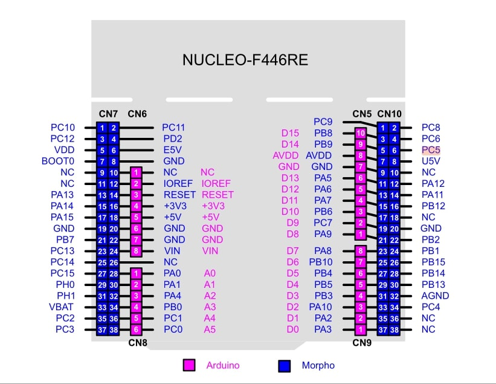

# Acceptance Test Plan  
## The Citadel Home Automation System

This document provides a comprehensive step-by-step validation guide for the **Citadel Home Automation System**.  
It is designed to verify:

- Hardware integrity  
- Software state transitions  
- Precise timing for all integrated peripherals  
- Visual pin-level correctness based on `config.h`

---

## 1. Pre-Test Configuration

Ensure your environment matches these hardware and software specifications before starting the tests.

---

## 2. Complete Peripheral Pin Mapping & Visualization

Use this table to **visually trace and validate each physical pin** during testing.

| Peripheral              | MCU Port | Pin No | Signal Name        | Mode / AF       | Expected Behavior                              |
|-------------------------|----------|--------|--------------------|------------------|-----------------------------------------------|
| LDR Sensor 1            | GPIOA    | PA0    | ADC1_IN0           | Analog Input     | ADC value 0–4095                              |
| LDR Sensor 2            | GPIOA    | PA1    | ADC1_IN1           | Analog Input     | ADC value 0–4095                              |
| UART2 TX (Debug)       | GPIOA    | PA2    | USART2_TX          | AF7              | Serial TX output                              |
| UART2 RX (Debug)       | GPIOA    | PA3    | USART2_RX          | AF7              | Serial RX input                               |
| Buzzer                  | GPIOA    | PA4    | BUZZER             | GPIO Output      | High = ON, Low = OFF                          |
| LED Green               | GPIOA    | PA5    | LED_GREEN          | GPIO Output      | High = ON                                     |
| LED Red                 | GPIOA    | PA6    | LED_RED            | GPIO Output      | High = ON                                     |
| LED White               | GPIOA    | PA7    | LED_WHITE          | GPIO Output      | High = ON                                     |
| DS18B20 Data            | GPIOA    | PA8    | 1-Wire Data        | GPIO Open-Drain  | Temp read pulse train                         |
| Bluetooth TX            | GPIOA    | PA9    | USART1_TX          | AF7              | Serial TX output                              |
| Bluetooth RX            | GPIOA    | PA10   | USART1_RX          | AF7              | Serial RX input                               |
| Keypad Row 0            | GPIOB    | PB0    | R0                 | GPIO Output      | Scan line toggles                             |
| Keypad Row 1            | GPIOB    | PB1    | R1                 | GPIO Output      | Scan line toggles                             |
| Keypad Row 2            | GPIOB    | PB2    | R2                 | GPIO Output      | Scan line toggles                             |
| Keypad Row 3            | GPIOB    | PB3    | R3                 | GPIO Output      | Scan line toggles                             |
| Keypad Column 0         | GPIOB    | PB4    | C0                 | GPIO Input PU    | Reads LOW on key press                       |
| Keypad Column 1         | GPIOB    | PB5    | C1                 | GPIO Input PU    | Reads LOW on key press                       |
| Keypad Column 2         | GPIOB    | PB6    | C2                 | GPIO Input PU    | Reads LOW on key press                       |
| Keypad Column 3         | GPIOB    | PB7    | C3                 | GPIO Input PU    | Reads LOW on key press                       |
| OLED SCL                | GPIOB    | PB8    | I2C1_SCL           | AF4              | Clock pulses ~100 kHz                         |
| OLED SDA                | GPIOB    | PB9    | I2C1_SDA           | AF4              | Data line toggles                             |
| RCWL Radar Sensor       | GPIOB    | PB10   | RCWL_OUT           | GPIO Input       | High on motion                               |
| // reomove this KY-028 Digital          | GPIOB    | PB11   | TEMP_ALARM         | GPIO Input       | High when threshold crossed                  |
| Relay 1                 | GPIOB    | PB12   | RELAY1             | GPIO Output      | High = ON                                     |
| Relay 2                 | GPIOB    | PB13   | RELAY2             | GPIO Output      | High = ON                                     |
| Relay 3                 | GPIOB    | PB14   | RELAY3             | GPIO Output      | High = ON                                     |
| Relay 4                 | GPIOB    | PB15   | RELAY4             | GPIO Output      | High = ON                                     |
| LCD RS                  | GPIOC    | PC0    | LCD_RS             | GPIO Output      | Register Select                              |
| LCD EN                  | GPIOC    | PC1    | LCD_EN             | GPIO Output      | Enable pulse                                 |
| LCD D4                  | GPIOC    | PC2    | LCD_D4             | GPIO Output      | Data nibble                                  |
| LCD D5                  | GPIOC    | PC3    | LCD_D5             | GPIO Output      | Data nibble                                  |
| LCD D6                  | GPIOC    | PC4    | LCD_D6             | GPIO Output      | Data nibble                                  |
| LCD D7                  | GPIOC    | PC5    | LCD_D7             | GPIO Output      | Data nibble                                  |
| IR Sensor 1             | GPIOC    | PC6    | IR1                | GPIO Input       | High on obstacle                             |
| IR Sensor 2             | GPIOC    | PC8    | IR2                | GPIO Input       | High on obstacle                             |
| Wakeup Button           | GPIOC    | PC13   | WAKEUP_BTN         | GPIO Input + EXTI| Falling edge interrupt                      |

---

## 2.1 STM32F446RE Pinout Reference

*Figure: STM32F446RE Nucleo-64 Board - Physical pinout for hardware verification and troubleshooting*

---

## 3. Phase 1: System Boot & Initialization

[Boot] → OLED/LCD welcome → White LED dim
       → UART: "System Boot Complete"
       → STATE: STANDBY

[Motion Detected] → STATE: AUTHENTICATING
                  → LCD: "Enter PIN: ****"
                  → PIN 1234 verified
                  → Green LED ON + Beep

[Main Menu] → Choose: Sensors / Control / Settings / Logout
            → Navigate with keypad
            → All actions logged to UART

[Sensor Monitor] → Auto-cycling displays
                 → LDR / Temp / Motion screens
                 → UART streaming data

[Device Control] → Toggle LEDs/Relays
                 → Enable LDR Auto Mode
                 → Buzzer feedback

[LDR Auto] → Darkness detected → Lights ON automatically!

## End of Test Plan
